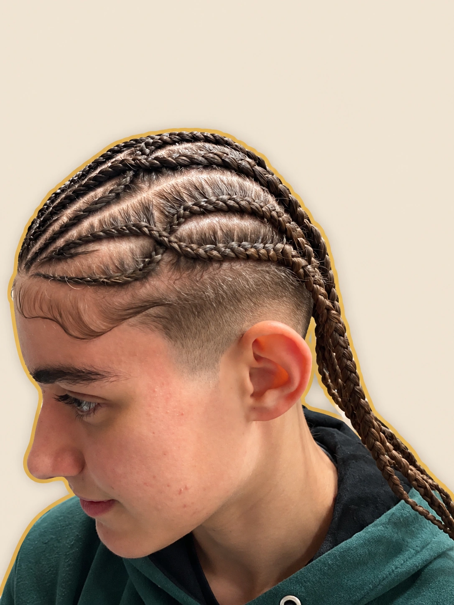
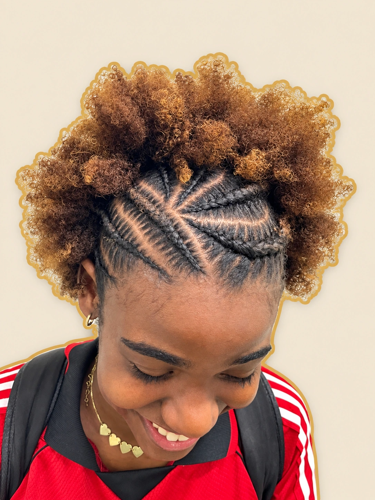

<div align="center">

# Julie · Arte em Tranças

### Seu estilo. Suas tranças. Do seu jeito.

Um site personalizado para apresentar o talento da Julie e facilitar o contato com novas clientes.

[](#tecnologias)
[](#tecnologias)
[](#tecnologias)

**[✦ Visitar o site](https://julie-arte-em-trancas.santosvitos259.chatgpt.site)** · **[Instagram](https://www.instagram.com/julie_trancas_/)** · **[WhatsApp](https://wa.me/5511910497848)**


</div>

## A ideia do projeto

A Julie faz tranças em Ferraz de Vasconcelos, com atendimento em domicílio ou no local de preferência da cliente. O site reúne seus trabalhos, apresenta quem ela é e cria um caminho simples para conversar sobre uma nova trança.

A identidade visual combina marrom, dourado e tons de creme, com personagens da própria Julie e fotos dos trabalhos. O resultado é uma apresentação acolhedora, com personalidade e fácil de usar no celular.

## Uma experiência pensada para a cliente

| Parte do site | O que a cliente encontra |
| --- | --- |
| Apresentação | Personagem da Julie, identidade visual e acesso rápido ao agendamento. |
| Estilos | Opções de tranças que levam ao formulário com o estilo selecionado. |
| Conheça a Julie | Uma apresentação natural e informações sobre o atendimento. |
| Galeria | 12 fotos selecionadas, com fundo neutro e contorno dourado. |
| Fotos em destaque | Ampliação, navegação entre imagens e botão para ver a foto original. |
| Agendamento | Escolha de estilo, sugestão de data, período, local e observações. |
| Dúvidas e contato | Respostas rápidas e links para Instagram e WhatsApp. |

## A galeria

As fotos foram organizadas para valorizar os detalhes das tranças. Imagens repetidas ou muito parecidas foram retiradas da seleção, mantendo ângulos que ajudam a conhecer o trabalho.

<div align="center">



</div>

Ao abrir uma imagem, a cliente pode ver a arte ou alternar para a foto original. A galeria também permite avançar, voltar e navegar pelo teclado.

## Como funciona o agendamento

1. A cliente escolhe o estilo que deseja.
2. Informa seu nome, sugere uma data e um período e indica o local de atendimento.
3. Pode acrescentar observações sobre o que quer fazer.
4. O site prepara uma mensagem com esses detalhes e abre o WhatsApp.
5. A cliente envia a mensagem, e a Julie confirma disponibilidade, materiais, valores e horário na conversa.

**A data é uma sugestão:** o formulário não reserva um horário automaticamente. O atendimento é confirmado pela Julie no WhatsApp.

## Visual e interação

- Layout responsivo, adaptado para computador e celular.
- Personagens personalizados na apresentação e no agendamento.
- Paleta em marrom, dourado e creme.
- Menu para celular, perguntas frequentes e botão flutuante do WhatsApp.
- Galeria ampliada com opção de consultar as fotos originais.
- Calendário com seleção de datas futuras, considerando o horário de São Paulo.

## Tecnologias

HTML, CSS e JavaScript puro. O projeto é estático e não precisa instalar dependências nem executar um processo de compilação.

```text
.
├── index.html     # Conteúdo e estrutura da página
├── styles.css     # Identidade visual e layout responsivo
├── app.js         # Galeria, calendário e formulário
└── assets/        # Fotos e personagens personalizados
```

## Executar localmente

Clone este repositório e, dentro da pasta, execute:

```sh
python3 -m http.server 8000
```

Depois acesse **http://localhost:8000** no navegador.

## Publicar no GitHub Pages

O site está organizado na raiz do repositório. Em **Settings → Pages**, selecione **Deploy from a branch**, branch **main** e pasta **/ (root)**. Os caminhos dos arquivos são relativos para funcionar nesse formato de publicação.

O site também está publicado em: **https://julie-arte-em-trancas.santosvitos259.chatgpt.site**.

## Personalizar

Edite `index.html` para atualizar os textos; `styles.css` para ajustar cores e layout; e `app.js` para alterar o comportamento do formulário e os dados da galeria. As imagens ficam em `assets/`.

---

<div align="center">

**Julie · Arte em Tranças**  
[Instagram @julie_trancas_](https://www.instagram.com/julie_trancas_/) · [WhatsApp 11 91049-7848](https://wa.me/5511910497848)

Projeto apresentado por **Vitor Santos Ferreira**.

</div>
